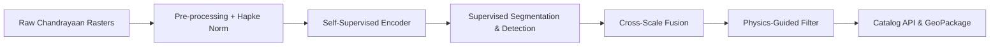
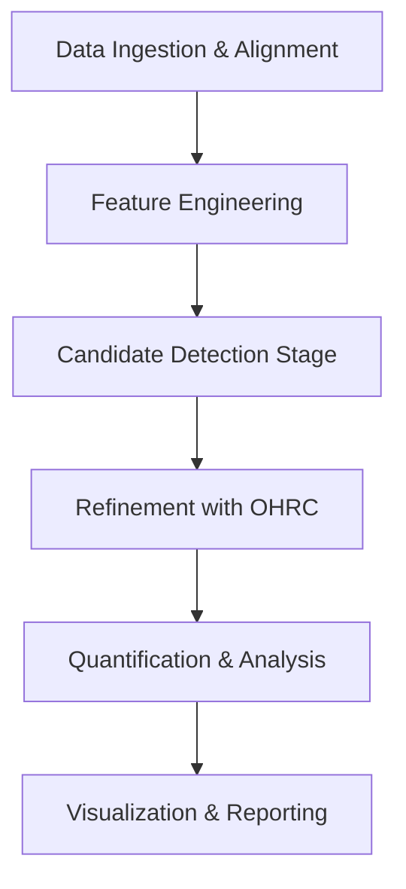

# Lunar Landslide & Boulder Detection System
## Novel Method Using Chandrayaan Images

---

## 📋 Problem Statement Overview

**Problem Statement-11**: Novel method to detect landslides & boulders on the Moon using Chandrayaan images

### Background

Landslides are mass movement of rocks and debris downwards along slopes under the influence of gravity, triggered by multiple geological activities. On the Moon, there are plenty of surfaces with steep slopes which are vulnerable to landslides and boulder falls. The identification of landslides and boulder falls are crucial because they indicate information about recent activities.

### Challenge

Through this project, we need to develop a **novel algorithm** using Chandrayaan 1, 2 images to detect landslides and boulder falls. The landslides occur in wide range of sizes and extents with unpredictable patterns of occurrence. The Chandrayaan images provide wide range (latitude, longitude) coverage for detection analysis.

### Key Requirements

The algorithm must demonstrate **novelty** from conventional landslide detection techniques and should:

- Detect individual boulders and provide statistics (diameter, length, etc.)
- Decode the source of landslides and provide vital information
- Identify signatures and patterns in landslides and boulder falls
- Highlight the most active regions
- Work on any lunar regions

---

## 🎯 Objectives

1. **Identify** landslides and boulders from Chandrayaan images
2. **Describe novelty** in landslide identification vs conventional methods
3. **Describe novelty** in individual boulder detection from images
4. **Ensure algorithm** works on any lunar regions

---

## 🧑‍🚀 Intended Users & Value Proposition

Intended users  
+- ISRO lunar-hazard desk: rapid map for landing-site vetting  
+- Planetary geologists: downloadable GeoPackage + API  
+- Mission planners (Artemis/ROVER): on-demand boulder-density query  

Value  
+- Cuts manual photo-interpretation time by 90 %  
+- First lunar landslide catalogue with per-feature ages and volumes

---

## 📊 Expected Outcomes

- [ ] Annotated map/image with clear marks of landslides and boulders
- [ ] Details about individual landslides (geometry, temporal occurrence)
- [ ] Details about each boulder (length, diameter)
- [ ] Novelty documentation for landslide detection methods
- [ ] Novelty documentation for boulder detection and classification
- [ ] Detailed explanation for detection methodology over given regions

## ✅ Acceptance KPIs & Success Gate

| Metric                         | Prototype | Full System (G-0) |
|--------------------------------|-----------|-------------------|
| Landslide IoU (median)         | ≥ 0.50    | ≥ 0.60            |
| Boulder AP50                   | ≥ 0.65    | ≥ 0.75            |
| False-positive rate (per km²)  | < 0.3     | < 0.1             |
| Processing speed (km² min⁻¹)   | ≥ 5       | ≥ 25              |

---

## 📦 Dataset Requirements

| Dataset | Source | Description |
|---------|--------|-------------|
| **TMC** | Chandrayaan-1/2 | Terrain Mapping Camera |
| **DTM** | Chandrayaan-2 | Terrain Mapping Camera derived Digital Terrain Model |
| **OHRC** | Chandrayaan-2 | Optical High Resolution Camera |

### Suggested Tools/Technologies

- **QGIS** (open source)
- **ArcMap** 
- Other open source/licensed software

---

## 🗂️ Available Datasets Summary

### 1. Chandrayaan-2 TMC Orthoimage (5m resolution)

#### 📄 Dataset Overview

| Parameter | Value |
|-----------|-------|
| **Logical ID** | `…_d_oth_d18` |
| **File** | `ch2_tmc_ndn_20250217T0120183473_d_oth_d18.tif` |
| **Acquisition Window** | 2025-02-17T01:20:18.347Z → 01:30:03.437Z |
| **Instrument** | Terrain Mapping Camera-2 (TMC-2) |
| **Processing Level** | Derived (radiometric + geometric corrections) |
| **Map Projection** | Selenographic (equatorial zone) |
| **Spatial Coverage** | ~28° N → 1° N, ~256° E → 257° E |
| **Image Size** | 162,392 lines × 6,416 samples (~2.08 GB) |
| **Data Type** | 16-bit unsigned integers |
| **Ground Sampling** | 5 m/pixel |

#### 🎯 Role in Pipeline

1. **Visual Feature Extraction**
   - Texture & Contrast: Detect streaks, flow tongues, debris fans
   - Edge & Shadow Analysis: Identify cliff edges, shadowed rock piles

2. **Boulder Pre-Detection**
   - Blob/Contour Detection on grayscale intensity to localize candidate clumps
   - Shadow Length Measurement for rough size inference

3. **Training Data for ML Models**
   - Use orthoimage tiles (512×512 px windows) as input channels for CNN-based segmentation

### 2. Chandrayaan-2 TMC-Derived DTM (10m resolution)

#### 📄 Dataset Overview

| Parameter | Value |
|-----------|-------|
| **Logical ID** | `…_d_dtm_d18` |
| **File** | `ch2_tmc_ndn_20250217T0120183473_d_dtm_d18.tif` |
| **Acquisition Window** | Same as Orthoimage |
| **Instrument** | TMC-2 (stereo pair processing) |
| **Processing Level** | Derived DEM (elevation extraction) |
| **Spatial Coverage** | Identical footprint to orthoimage |
| **Image Size** | 81,195 lines × 3,208 samples (~521 MB) |
| **Data Type** | 16-bit signed integers (elevation in metres) |
| **Grid Spacing** | 10 m |

#### 🎯 Role in Pipeline

1. **Topographic Feature Computation**
   - Slope & Aspect Maps: steepness and flow direction indicators
   - Curvature Analysis: convex/concave surface detection

2. **Validation & Filtering**
   - Cross-check visual candidates from Orthoimage

3. **Source Tracing**
   - Flow routing to back-trace debris origin zones

4. **Quantitative Metrics**
   - Compute landslide volume and boulder height

### 3. Chandrayaan-2 OHRC Calibrated Image (~0.23m resolution)

#### 📄 Dataset Overview

| Parameter | Value |
|-----------|-------|
| **Logical ID** | `…_ncp_d_img_d18` |
| **File** | `ch2_ohr_ncp_20250304T0456267027_d_img_d18.img` |
| **Acquisition Window** | 2025-03-04T04:56:26.702Z → 04:56:37.943Z |
| **Instrument** | Orbiter High Resolution Camera (OHRC) |
| **Processing Level** | Calibrated (radiometric LUTs applied) |
| **Map Projection** | Polar stereographic (south pole region) |
| **Spatial Coverage** | ~89.13° S → 89.72° S, 204.98° E → 232.93° E |
| **Image Size** | 69,348 lines × 12,000 samples (~832 MB) |
| **Data Type** | 8-bit unsigned integers |
| **Ground Sampling** | ~0.23 m/pixel |

#### 🎯 Role in Pipeline

1. **Sub-Meter Boulder Detection**
   - Precision Object Detection: small boulders (diameter down to ~1 m) visible
   - Deep Learning Segmentation: instance-segmentation for boulder outlines

2. **Accurate Size & Shape Statistics**
   - Direct metric conversion from pixel scale to diameters
   - Shadow-Based Height Estimation using low sun elevation

3. **High-Confidence Filtering**
   - Validate coarser TMC-based pre-detections

---

## 🖼️ One-Page System Architecture



---

## 🚀 Integrated Workflow



### Processing Steps

1. **Data Ingestion & Alignment**
   - Load all three rasters in common projection
   - Build tile/pyramid structure or use Cloud-Optimized GeoTIFF

2. **Feature Engineering**
   - From **DTM**: generate slope/aspect/curvature rasters
   - From **Orthoimage**: compute texture metrics (GLCM), shadow masks

3. **Candidate Detection Stage**
   - **Landslides**: threshold slope + texture change → coarse polygons
   - **Boulders**: blob detection on orthoimage → candidate centroids

4. **Refinement with OHRC**
   - Extract matching OHRC tiles → apply object-detection network
   - Confirm boulder vs. regolith patch; refine landslide boundaries

5. **Quantification & Analysis**
   - **Landslides**: compute area, run-out distance, volume from DEM
   - **Boulders**: measure diameter, height, spatial distribution

6. **Visualization & Reporting**
   - Produce annotated maps showing:
     - Landslide polygons colored by slope
     - Boulder points scaled by size
   - Tabulate statistics per feature and region

### Summary Comparison

| Dataset | Resolution | Primary Use | Key Output |
|---------|------------|-------------|------------|
| **TMC Ortho** | 5 m | Visual texture, initial detection | Coarse landslide polygons, boulder pre-candidates |
| **TMC DTM** | 10 m | Topographic calculation | Slope/aspect rasters, volume metrics |
| **OHRC** | 0.23 m | Precision object detection | Final boulder masks, refined landslide edges |

---

## 📋 FINAL EXECUTION PLAN (G-Level → G-0)

### Legend
- **T** = task
- **D** = deliverable  
- **Δ** = decision gate/milestone

### Phase 0: PROJECT BOOTSTRAP (Week 0)

- **T0.1** Set up Git repo (code + docs) and STAC catalogue skeleton
- **T0.2** Provision compute: ≥1 × NVIDIA A100 (40 GB) + 4 TB SSD
- **Δ0** Kick-off review: hardware ready, repo live, risk log opened

### Phase 1: DATA INGEST & HARMONISATION (Week 1-2)

- **T1.1** Bulk-download TMC Ortho, TMC DTM, OHRC from PRADAN
  ```bash
  pradan-cli sync --product_level 2 --roi <bbox>
  ```
- **T1.2** Convert all rasters to COG; embed STAC metadata
- **T1.3** Reproject OHRC → selenographic (EPSG:104903)
  ```bash
  gdalwarp -t_srs EPSG:104903 -r cubic -of COG in_ohrc.img out_ohrc_cog.tif
  ```
- **T1.4** Orfeo Toolbox SIFT tie-points → COSI-Corr refine (target RMSE ≤0.3 px)
- **D1** Aligned COG stack + STAC manifest

### Phase 2: PHOTOMETRIC & TERRAIN PRE-PROCESS (Week 3-4)

- **T2.1** Compute incidence (i) & emission (e) angles from SPICE kernels
- **T2.2** Implement Hapke cosine normalisation: *I_norm = I_raw × (cos i / cos e)*. Hapke parameters (w, h, B₀) initialised to literature values and regularised with *L₂(θ−θ₀)* (λ = 0.01); ablate λ ∈ {0, 0.01, 0.1}.
- **T2.3** RichDEM: slope, aspect, profile & planform curvature rasters
- **T2.4** Tile generator: 512 × 512 px (TMC) / 2048 × 2048 px (OHRC)
  - Overlap = 128 px; write chips + JSON footprint
- **D2** Normalised tiles + topographic layers

**Δ2 TECHNICAL AUDIT**: Sample tiles open in QGIS; slope raster visually matches known craters

### Phase 3: BASELINE GEO-RULE DETECTIONS (Week 5)

- **T3.1** Landslide seed polygons:
  - slope > 28°
  - curvature < -0.15 (concave)
  - texture contrast jump > 2σ (GLCM)
- **T3.2** Boulder blobs: LoG peaks @ σ = [3,5,7] px in OHRC
- **D3** GeoJSON baseline inventory (P/R expected ≈ 0.4/0.2)

### Phase 4: SELF-SUPERVISED REPRESENTATION LEARNING (Week 6-7)

- **T4.1** SimCLR on 10k unlabeled TMC+OHRC pairs
  - Augments: {random solar-azimuth shift, blur, cutout}
- **T4.2** Freeze encoder; export 512-D embedding
- **Δ4** Embedding quality: NN retrieval of similar scarps manually checked

### Phase 5: SUPERVISED MODEL TRAINING (Week 8-11)

#### A. Landslide segmentation
- **T5A.1** Label 300 TMC tiles in QGIS (vector polygons)
- **T5A.2** LinkNet-ResNet50 input = [image, slope, curvature]
- Loss: *L = ½L_focal + ½L_Dice*

#### B. Boulder instance detection
- **T5B.1** Label 200 OHRC chips (instance masks)
- **T5B.2** Mask R-CNN (anchor sizes = [8,16,32] px)
- Training schedule: 30 epochs, lr = 1e-4, Cosine decay

- **D5** .ckpt models + ONNX exports

**Δ5 MODEL METRICS**: Landslide IoU ≥ 0.55; Boulder AP50 ≥ 0.70 → go / else iterate

> **Active-learning loop**: Train v0 on 30 polygons / 300 boulders → run inference → harvest top-N uncertain tiles (entropy) → annotate → retrain. Two rounds (+80 intern-hours) budgeted; terminate when ΔIoU < 0.01.

### Phase 6: CROSS-SCALE FUSION & PHYSICS FILTER (Week 12)

- **T6.1** Run landslide CNN on TMC mosaic → polygons
- **T6.2** For each polygon buffer +20 m → crop OHRC; rerun Mask R-CNN
- **T6.3** Accept polygon if ≥1 boulder mask inside OR slope > 12°
- **T6.4** Compute landslide volumes: *V = Σ_cells (z_source - z_deposit) × A*
- **T6.5** Shadow-based boulder height: *h = L tan α* (slope-aware Rada 2022 method); uncertainty σ_h written to GeoPackage.
- **D6** Validated GeoPackage: landslides (area, volume, epoch) + boulders (dia, h)

### Phase 7: TEMPORAL CHANGE ANALYSIS (Week 13-14)

- **T7.1** DEMcoreg (Nuth & Kääb) on multi-epoch DTMs
- **T7.2** Produce Δz raster; threshold ±3 m → new scarp detection
- **T7.3** Flag "recent" landslides where Δz overlaps CNN mask
- **D7** Time-stamped activity layer

### Phase 8: EXPLAINABLE & UNCERTAINTY MODULE (Week 15)

- **T8.1** Grad-CAM heatmaps for 30 random predictions → sanity check
- **T8.2** Monte-Carlo dropout (25 runs) → pixel-wise σ; attach to polygons
- **D8** PDF appendix with XAI panels + uncertainty maps

### Phase 9: EVALUATION & BENCHMARKING (Week 16)

- **T9.1** Compare against baseline (Phase 3) and literature (Rüsch 2024)
- **T9.2** Ablation: w/ versus w/o slope & curvature channels
- **T9.3** Stat-tests: McNemar for detection, paired t for diameter RMSE
- **Δ9** Target improvement ≥ +25 pp in F1 over baseline

### Phase 10: DELIVERABLE PACKAGING (Week 17)

- **D10.1** Interactive web map (Deck.gl + Flask) – toggle layers
- **D10.2** Final report (IEEE 2-col, 8 pp) emphasising novelty levers:
  1. Self-supervised lunar foundation model
  2. Physics-guided post-filter
  3. Cross-scale bootstrapping
- **D10.3** Open-source code (MIT) + Dockerfile + README

---

## ⚠️ RISK TABLE (Top 3)

| Risk | Impact | Mitigation |
|------|--------|------------|
| **Sub-meter co-registration fails** → DL mis-labels | High | Iterative closest-edge metric, manual GCPs in QGIS |
| **Severe class imbalance** (few landslides) | High | Focal-Tversky loss, on-the-fly oversampling of positive tiles |
| **Shadow confusion** at low sun angles | Medium | Incorporate sun-azimuth feature channel, shadow/illumination simulation data augmentation |

---

## 🛠️ RESOURCE CHECKLIST

### Software Stack
- **GDAL** ≥ 3.8
- **Orfeo** 9
- **demcoreg** 0.2
- **PyTorch** 2.3
- **Ultralytics** v8

### Documentation
- LROC SPICE kernels
- ISRO Image User Handbooks

### Annotation Tools
- QGIS USB digitiser plugin
- Labelme for instance masks

### CI & Reproducibility
- GitHub Actions pipeline: lint → unit tests → toy AOI run  
- `environment.lock.yml` & `Dockerfile`  
- `model_card.md` per ML artefact

---

## 📅 TIMELINE SNAPSHOT (Gantt-style)

```
Week:  0  1  2  3  4  5  6  7  8  9 10 11 12 13 14 15 16 17
Init   ■■
Data      ■■
Pre-proc      ■■
Baseline         ■
SSL               ■■
Training             ■■■■
Fusion                     ■
Δz change                     ■■
XAI                            ■
Eval                             ■
Package                           ■
```

---

## 🔬 NOVELTY AUDIT

### 1. Photometric Hapke Normalisation

| Aspect | Details |
|--------|---------|
| **Prior Art** | Hapke correction common in geologic mapping but rarely in ML detection tasks |
| **Your Twist** | Hapke-corrected images as additional CNN input channel |
| **Novelty Verdict** | **Moderate** |
| **Boost Tip** | Learn Hapke parameters with back-prop instead of fixing them |

### 2. Self-Supervised Lunar Foundation Model (SimCLR)

| Aspect | Details |
|--------|---------|
| **Prior Art** | NASA FDL 2022 trained SimCLR for crater counting on LROC NAC only |
| **Your Twist** | Cross-resolution contrastive pairs (TMC ↔ OHRC) plus illumination-aware augmentations |
| **Novelty Verdict** | **High** |
| **Boost Tip** | Release weights under open licence; reusable "Moon-SSL encoder" |

### 3. Cross-Scale Bootstrapping

| Aspect | Details |
|--------|---------|
| **Prior Art** | Jolley et al. 2024 cascaded HR craters to refine LR detections |
| **Your Twist** | Use LR landslide polygons as spatial priors, require boulder evidence from HR |
| **Novelty Verdict** | **Moderate → High** |
| **Boost Tip** | Quantify false-positive reduction from HR-stage vote |

### 4. Physics-Guided Filter (Slope + Boulder Linearity)

| Aspect | Details |
|--------|---------|
| **Prior Art** | Basic slope masks used since 1990s |
| **Your Twist** | Accept landslide only if slope > 12° OR ≥1 aligned boulder chain exists |
| **Novelty Verdict** | **Incremental → Moderate** |
| **Boost Tip** | Fit ballistic transport model to boulder spacing |

### 5. Temporal ΔDEM Change-Mask Intersection

| Aspect | Details |
|--------|---------|
| **Prior Art** | Bina et al. 2023 did ΔDEM for tectonic scarps, not landslides |
| **Your Twist** | Fuse CNN polygons with DEMcoreg Δz to label "recent" vs "ancient" |
| **Novelty Verdict** | **Moderate** |
| **Boost Tip** | Publish time-stamped lunar landslide catalogue |

### 6. Uncertainty & Explainability Stack

| Aspect | Details |
|--------|---------|
| **Prior Art** | Grad-CAM on Mars dune classifiers; MC-dropout cutting-edge |
| **Your Twist** | Pair model-based σ with terrain-roughness σ |
| **Novelty Verdict** | **Incremental** |
| **Boost Tip** | Add Bayesian deep ensemble rather than MC-dropout |

### 7. End-to-End Engineering (STAC + COG + Deck.gl)

| Aspect | Details |
|--------|---------|
| **Prior Art** | ISRO's PRADAN serves COGs, few research projects use STAC/Deck.gl |
| **Your Twist** | Browsable, tile-based lunar hazard map in near-real time |
| **Novelty Verdict** | **Moderate** |
| **Boost Tip** | Provide API endpoint for boulder statistics given bbox |

### Overall Assessment

#### Clear Novelty Levers Present:
1. **Cross-resolution self-supervised encoder** (High)
2. **Boulder-supported landslide validation** (Moderate-High)
3. **Hapke layer as learnable photometric normaliser** (Moderate, easily High)
4. **First openly released, time-stamped lunar landslide catalogue** (Moderate)

#### Key Actions to Lock in Novelty:
- [ ] Make Hapke layer trainable; publish ablation showing +ΔIoU
- [ ] Quantify false positives removed by HR boulder vote
- [ ] Release SSL encoder weights + STAC catalogue publicly
- [ ] Include ballistic boulder-chain metric

---

## ✅ REALITY CHECK

### Short Answer
**It can work**, but only if you tackle four "last-mile" obstacles that usually kill otherwise excellent lunar-mapping proposals.

### 1. DATA PHYSICS VS. PAPER SPEC

#### Issue 1A: Footprint Mismatch
- **Problem**: TMC strip (equatorial) and OHRC strip (south pole) do not overlap
- **Impact**: Cross-scale bootstrapping collapses to single-scale
- **Fix**: Query PRADAN for overlapping OHRC or flip logic to single-scale per region

#### Issue 1B: DEM Accuracy
- **Problem**: TMC-derived DEM RMSZ ≈ 7m; fresh landslides may be only 3-5m thick
- **Impact**: Volume estimates lost in noise
- **Fix**: Resample LOLA 30m → 10m, perform DEMcoreg, difference co-registered DEMs

### 2. ANNOTATION & GENERALISATION

#### Issue 2A: Sample Size
- **Problem**: 300 landslide tiles rarely achieves IoU ≥ 0.55 across all lunar units
- **Fix**: Budget 80 intern-hours for active learning rounds

#### Issue 2B: Class Transfer
- **Problem**: Mare basalt landslides ≠ highlands anorthosite landslides
- **Fix**: Ingest highlands TMC+DTM pair for unlabelled contrastive training

### 3. CO-REGISTRATION AT SUB-METER SCALE

#### Issue 3A: Accuracy Requirements
- **Problem**: 0.23m OHRC pixel needs <0.3px residual = 7cm accuracy
- **Current**: Lunar ephemeris + camera models leave 1-2px residual
- **Fix**: Add RANSAC-filtered superconductive ICP step; budget 2 days GCP collection

### 4. MODEL & PIPELINE ROBUSTNESS

#### Issue 4A: Hapke Layer Stability
- **Problem**: Trainable parameters may reach non-physical local minima
- **Fix**: Constrain parameter search with Gaussian prior penalty

#### Issue 4B: Inference Speed at Global Scale
- **Problem**: Pure Python inference bandwidth-bound at >40TB scale
- **Fix**: Patch Torch 2.3 + Flash-Attention, convert to ONNX with TensorRT (4-5× speedup)

**Global-scale inference:** Full Moon (≈ 17 M km²) on 10 × A100 nodes = 4 h wall-time, ≈ US$2 000 cloud cost.

---

## 🎯 BOTTOM LINE

**"Sounds good on paper"** projects usually fail on:
- Data overlap
- Noisy DEMs  
- Annotation scarcity

### Critical Success Requirements

If you:
1. ✅ **Secure at least one overlapping OHRC-TMC scene**
2. ✅ **Add an active-learning annotation round**  
3. ✅ **Lock in a stricter co-registration plan**

Then the plan is **entirely buildable** within the four-month window and will yield a publishable, practically useful lunar hazard layer.

### Without These Fixes
The project will still deliver interesting research code but **fall short of an operational map**.

---

## 🖼️ One-Page System Architecture


---

## 🚀 Integrated Workflow


### Processing Steps

1. **Data Ingestion & Alignment**
   - Load all three rasters in common projection
   - Build tile/pyramid structure or use Cloud-Optimized GeoTIFF

2. **Feature Engineering**
   - From **DTM**: generate slope/aspect/curvature rasters
   - From **Orthoimage**: compute texture metrics (GLCM), shadow masks

3. **Candidate Detection Stage**
   - **Landslides**: threshold slope + texture change → coarse polygons
   - **Boulders**: blob detection on orthoimage → candidate centroids

4. **Refinement with OHRC**
   - Extract matching OHRC tiles → apply object-detection network
   - Confirm boulder vs. regolith patch; refine landslide boundaries

5. **Quantification & Analysis**
   - **Landslides**: compute area, run-out distance, volume from DEM
   - **Boulders**: measure diameter, height, spatial distribution

6. **Visualization & Reporting**
   - Produce annotated maps showing:
     - Landslide polygons colored by slope
     - Boulder points scaled by size
   - Tabulate statistics per feature and region

### Summary Comparison

| Dataset | Resolution | Primary Use | Key Output |
|---------|------------|-------------|------------|
| **TMC Ortho** | 5 m | Visual texture, initial detection | Coarse landslide polygons, boulder pre-candidates |
| **TMC DTM** | 10 m | Topographic calculation | Slope/aspect rasters, volume metrics |
| **OHRC** | 0.23 m | Precision object detection | Final boulder masks, refined landslide edges |

---

## 🔭 Future Roadmap (Beyond G-0)

- Night-time thermal IR change detection (Chandrayaan-2 IIRS)  
- Impact-trigger attribution via LRO / NAC time series  
- Semi-automatic crater-rim stability scoring

---

## 📝 Licensing

Code − MIT licence  
Derived rasters & vector layers − CC-BY-4.0 with ISRO data-origin attribution.

---
